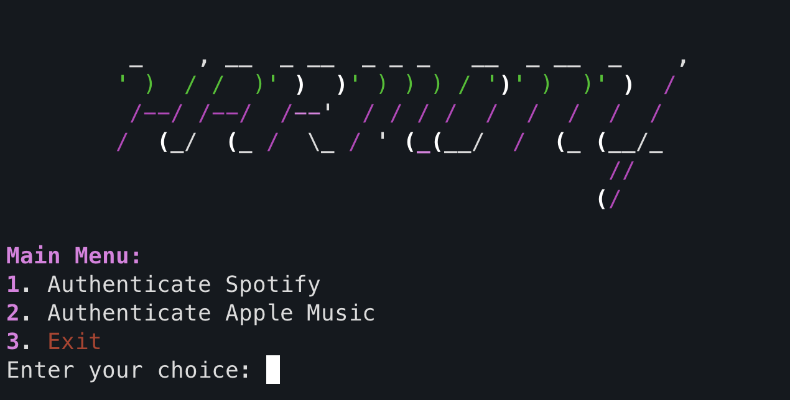
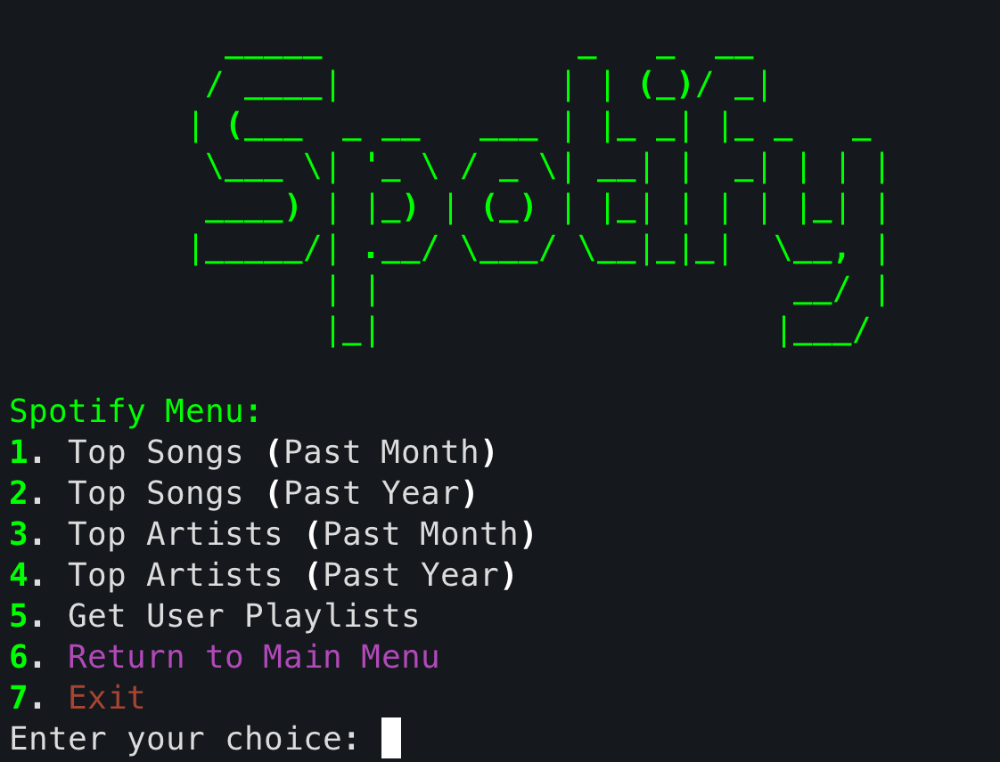
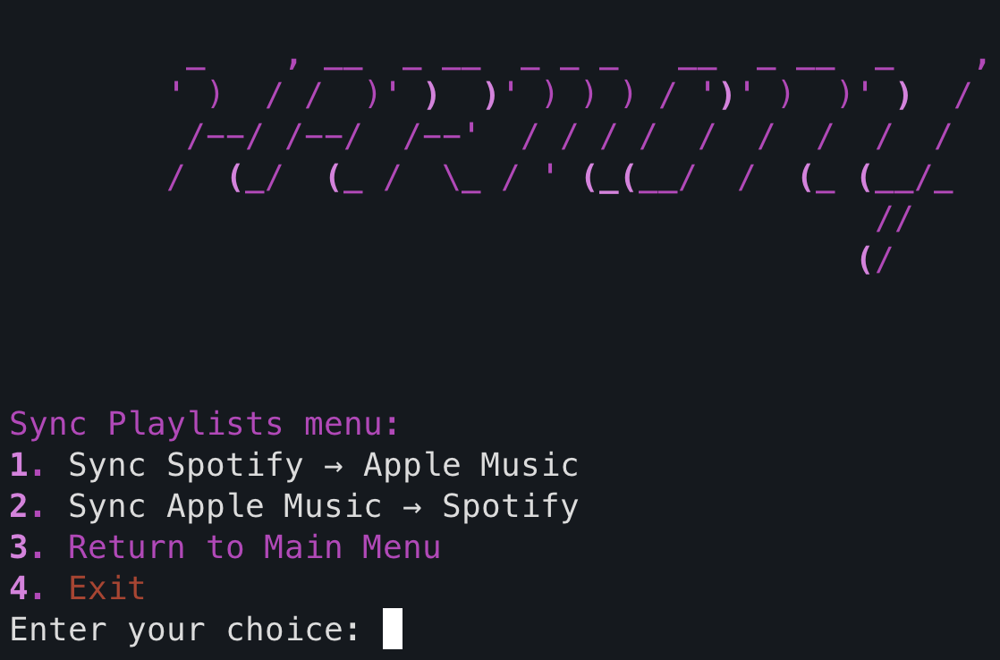

[](https://www.python.org/)
[](LICENSE)
[](https://github.com/achandy/harmony)
[](https://github.com/achandy/harmony/commits/main)


*A CLI app for viewing your music stats and syncing playlists across Spotify and Apple Music.*


## Features

- **Spotify**
  - View top songs and artists
  - Browse your playlists
- **Apple Music**
  - View top albums
  - Browse your playlists
- **Syncing**
  - Migrate playlists between platforms with one command


## Installation

1. Clone the repository:

   ```bash
   git clone https://github.com/achandy/harmony.git
   cd harmony
   ```

2. Install dependencies and application

   ```bash
   make install
   ```

3. Set up a developer account

   - **Spotify** *(Free)*  
     [Getting Started with Spotify Web API](https://developer.spotify.com/documentation/web-api/tutorials/getting-started)

   - **Apple Music** *(Paid Subscription Required)*  
     [Create a Private Key for Apple Music API](https://developer.apple.com/help/account/keys/create-a-private-key/)

4. Create a `.env` file in the root directory and provide the required environment variables:

   - For Spotify:
     - `SPOTIFY_CLIENT_ID`
     - `SPOTIFY_CLIENT_SECRET`

   - For Apple Music:
     - `APPLE_KEY_ID`
     - `APPLE_TEAM_ID`
     - `APPLE_PRIVATE_KEY`


## Usage

**Run the Harmony CLI**  
Use either of the following commands:

```bash
harmony
# or
make run
````


**Main Menu**  


**Authenticate Spotify or Apple Music**




**Authenticate both for Sync Menu**




## Testing

   ```bash
   make test
   ```

## Prerequisites

- **Python**: Requires Python 3.7 or higher.
- **Dependencies**:
    - Ensure all required libraries are installed via `requirements.txt`.


## Contributing

Pull requests are welcome! For major changes, please open an issue first to discuss what you’d like to change.


## License

This project is licensed under the MIT License. See the [LICENSE](LICENSE) file for details.


## Author

Developed by **Allan Chandy**  
Email: *chandyallan@gmail.com*

